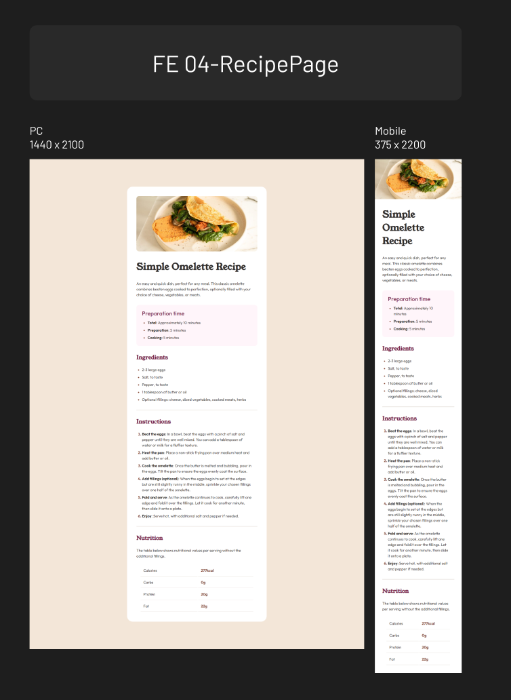

# Frontend Mentor - Recipe page solution

This is a solution to the [Recipe page challenge on Frontend Mentor](https://www.frontendmentor.io/challenges/recipe-page-KiTsR8QQKm). Frontend Mentor challenges help you improve your coding skills by building realistic projects.

## Table of contents

- [Overview](#overview)
  - [Screenshot](#screenshot)
  - [Links](#links)
- [My process](#my-process)
  - [Built with](#built-with)
  - [What I learned](#what-i-learned)

## Overview

### Screenshot

### Links

- Solution URL: [https://github.com/mulneng/frontend-mentor/tree/main/04-RecipePage]
- Live Site URL: [https://mulneng.github.io/frontend-mentor/04-RecipePage/]

## My process

### Built with

- Semantic HTML5 markup
- CSS custom properties

### What I learned

HTML

- Using table tag

CSS

- Design a responsive layout using max-width and width
- Styling li & table
