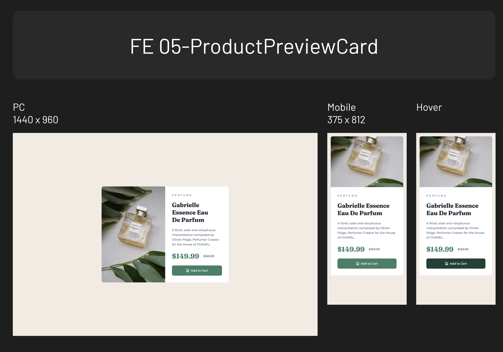

# Frontend Mentor - Product Preview Card

This is a solution to the [Product preview card component challenge on Frontend Mentor](https://www.frontendmentor.io/challenges/product-preview-card-component-GO7UmttRfa). Frontend Mentor challenges help you improve your coding skills by building realistic projects. 

## Table of contents

- [Overview](#overview)
  - [Screenshot](#screenshot)
  - [Links](#links)
- [My process](#my-process)
  - [Built with](#built-with)
  - [What I learned](#what-i-learned)

## Overview

### Screenshot

### Links

- Solution URL: [https://github.com/zeegu/frontend-mentor/tree/main/05-ProductPreviewCard]
- Live Site URL: [https://zeegu.github.io/frontend-mentor/05-ProductPreviewCard]

## My process

### Built with

- Semantic HTML5 markup
- CSS custom properties

### What I learned

CSS

- Create css using Sass
- Considering responsive layout
