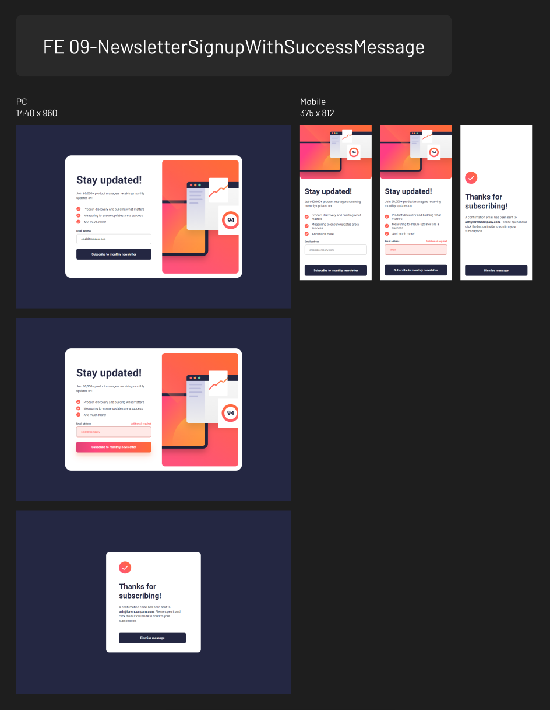

# Frontend Mentor - Newsletter sign-up form with success message solution

This is a solution to the [Newsletter sign-up form with success message challenge on Frontend Mentor](https://www.frontendmentor.io/challenges/newsletter-signup-form-with-success-message-3FC1AZbNrv). Frontend Mentor challenges help you improve your coding skills by building realistic projects.

## Table of contents

- [Overview](#overview)
  - [Screenshot](#screenshot)
  - [Links](#links)
- [My process](#my-process)
  - [Built with](#built-with)
  - [What I learned](#what-i-learned)

## Overview

### Screenshot

### Links

- Solution URL: [https://github.com/zeegu/frontend-mentor/tree/main/09-NewsletterSignupWithSuccessMessage]
- Live Site URL: [https://zeegu.github.io/frontend-mentor/09-NewsletterSignupWithSuccessMessage]

## My process

### Built with

- Semantic HTML5 markup
- CSS custom properties
- Javascript

### What I learned

CSS

- Hover animation

JS

- Email validation
- Connecting functions with event handler
