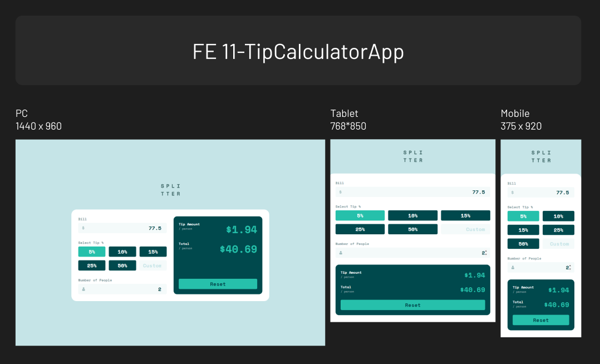

# Frontend Mentor - Tip calculator app solution

This is a solution to the [Tip calculator app challenge on Frontend Mentor](https://www.frontendmentor.io/challenges/tip-calculator-app-ugJNGbJUX). Frontend Mentor challenges help you improve your coding skills by building realistic projects.

## Table of contents

- [Overview](#overview)
  - [Screenshot](#screenshot)
  - [Links](#links)
- [My process](#my-process)
  - [Built with](#built-with)
  - [What I learned](#what-i-learned)

## Overview

### Screenshot

### Links

- Solution URL: [https://github.com/mulneng/frontend-mentor/tree/main/11-TipCalculatorApp]
- Live Site URL: [https://mulneng.github.io/frontend-mentor/11-TipCalculatorApp]

## My process

### Built with

- Semantic HTML5 markup
- CSS custom properties
- SASS
- Javascript

### What I learned

JS

- Refactoring codes
- Handling button clicks and input fields
- Showing statement according to the css class value
