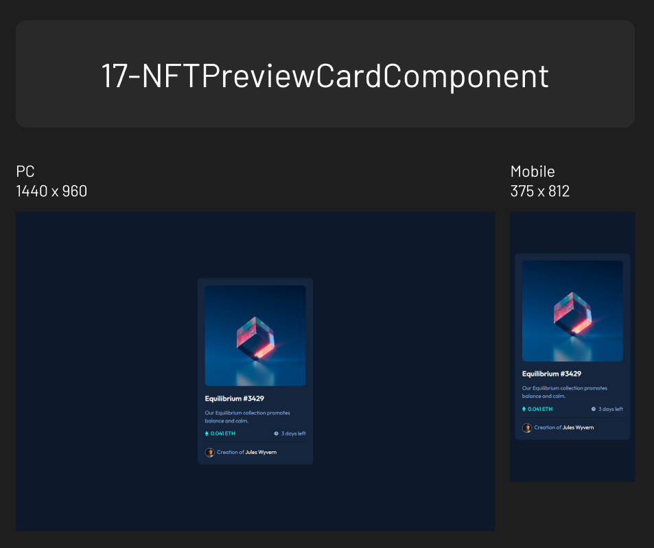

# Frontend Mentor - NFT preview card component solution

This is a solution to the [NFT preview card component challenge on Frontend Mentor](https://www.frontendmentor.io/challenges/nft-preview-card-component-SbdUL_w0U). Frontend Mentor challenges help you improve your coding skills by building realistic projects.

## Table of contents

- [Overview](#overview)
  - [Screenshot](#screenshot)
  - [Links](#links)
- [My process](#my-process)
  - [Built with](#built-with)
  - [What I learned](#what-i-learned)

## Overview

### Screenshot

### Links

- Solution URL: [https://github.com/mulneng/frontend-mentor/tree/main/17-NFTPreviewCardComponent]
- Live Site URL: [https://mulneng.github.io/frontend-mentor/17-NFTPreviewCardComponent]

## My process

### Built with

### What I learned

- CSS Naming convention (OOCSS, BEM)
