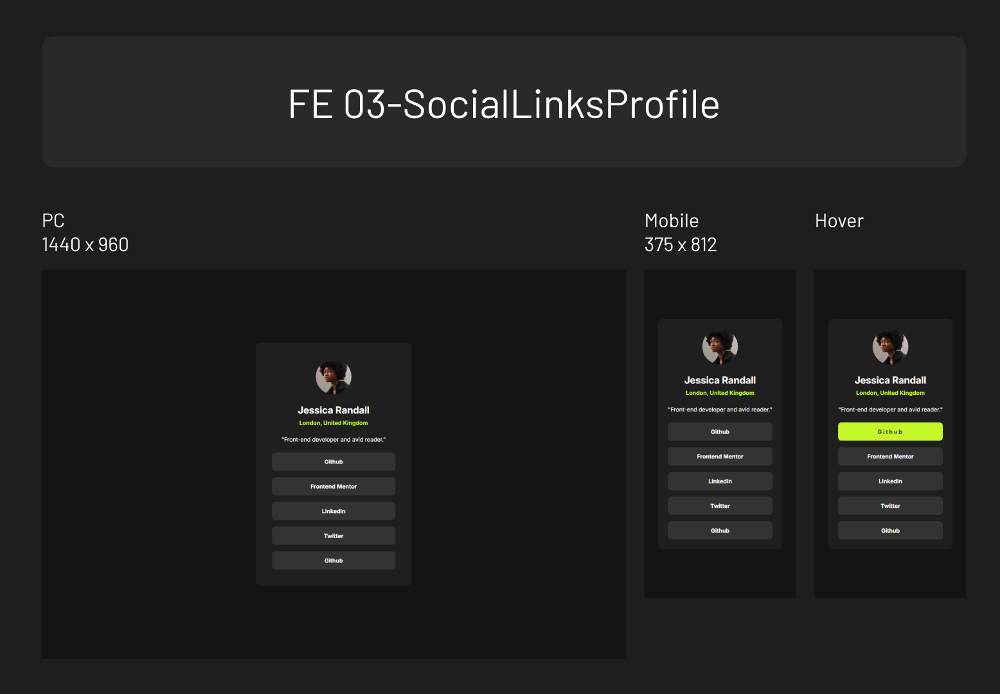

# frontend-mentor

Challenges from Frontend Mentor

## Table of contents

- [01 QRcode](#01-qrcode)
  - [01 Screenshot](#01-screenshot)
  - [01 Links](#01-links)
- [02 BlogPreview](#02-blogpreview)
  - [02 Screenshot](#02-screenshot)
  - [02 Links](#02-links)

## 01 QRcode

### 01 Screenshot

### 01 Links

- Solution URL: [https://github.com/zeegu/frontend-mentor/tree/main/01-QRcode]
- Live Site URL: [https://zeegu.github.io/frontend-mentor/01-QRcode/]

## 02 BlogPreview

### 02 Screenshot

### 02 Links

- Solution URL: [https://github.com/zeegu/frontend-mentor/tree/main/02-BlogPreview]
- Live Site URL: [https://zeegu.github.io/frontend-mentor/02-BlogPreview/]

## 03 SocialLinksProfile

### 03 Screenshot

### 03 Links

- Solution URL: [https://github.com/zeegu/frontend-mentor/tree/main/03-SocialLinksProfile]
- Live Site URL: [https://zeegu.github.io/frontend-mentor/03-SocialLinksProfile/]
