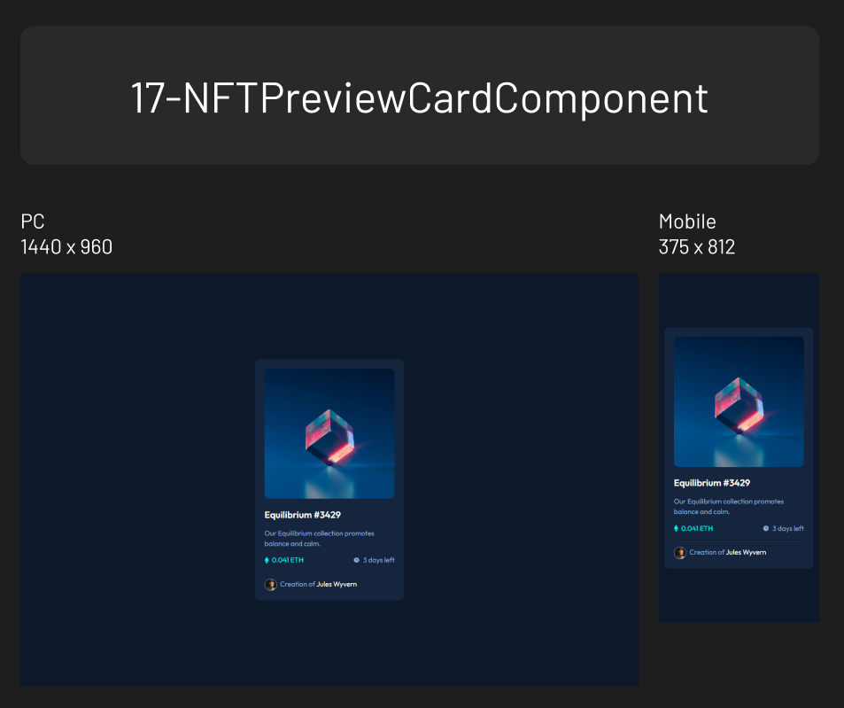
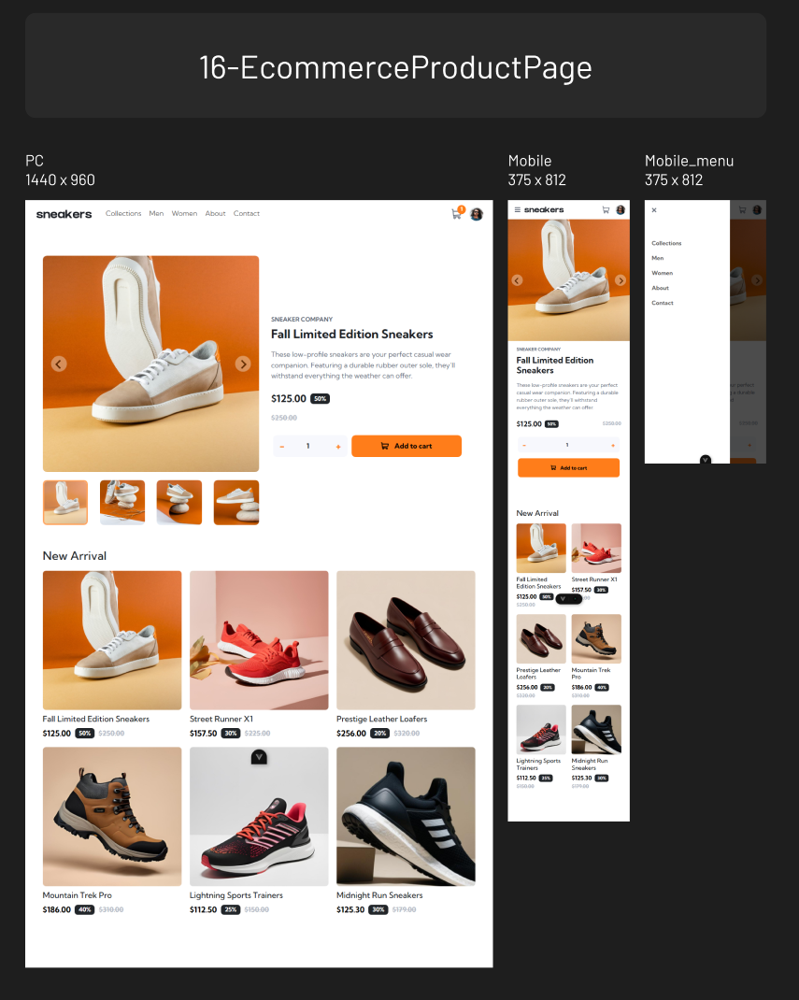
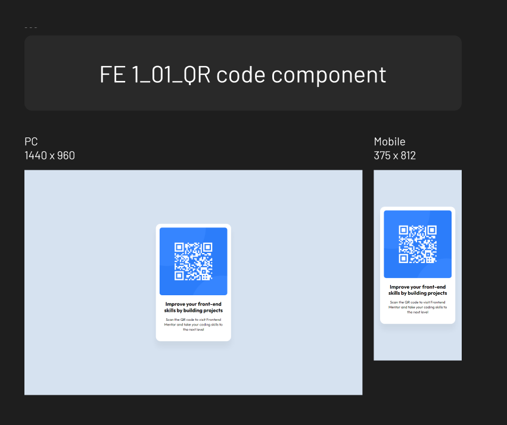

# frontend-mentor

Challenges from Frontend Mentor
⬇ Check my Frontend Mentor page
https://www.frontendmentor.io/profile/mulneng

## Table of contents

- [18 Loopstudios](#18-loopstudios)
- [17 NFTPreviewCardComponent](#17-nftpreviewcardcomponent)
- [16 EcommerceProductPage](#16-ecommerceproductpage)
- [15 NewsHomepage](#15-newshomepage)
- [14 ContactFormMain](#14-contactformmain)
- [13 FaqAccordion](#13-faqaccordion)
- [12 InteractiveRatingComponent](#12-interactiveratingcomponent)
- [11 TipCalculatorApp](#11-tipcalculatorapp)
- [10 TimeTrackingDashboard](#10-timetrackingdashboard)
- [09 NewsletterSignupWithSuccessMessage](#09-newslettersignupwithsuccessmessage)
- [08 ArticlePreviewComponent](#08-articlepreviewcomponent)
- [07 TestimonialsGridSection](#07-testimonialsgridsection)
- [06 FourCardFeatureSection](#06-fourcardfeaturesection)
- [05 ProductPreviewCard](#05-productpreviewcard)
- [04 RecipePage](#04-recipepage)
- [03 SocialLinksProfile](#03-sociallinksprofile)
- [02 BlogPreview](#02-blogpreview)
- [01 QRcode](#01-qrcode)

## 18 Loopstudios

### 18 Screenshot

### 18 Links

- Solution URL: [https://github.com/mulneng/frontend-mentor/tree/main/18-Loopstudios]
- Live Site URL: [https://mulneng.github.io/frontend-mentor/18-Loopstudios]

## 17 NFTPreviewCardComponent

### 17 Screenshot

### 17 Links

- Solution URL: [https://github.com/mulneng/frontend-mentor/tree/main/17-NFTPreviewCardComponent]
- Live Site URL: [https://mulneng.github.io/frontend-mentor/17-NFTPreviewCardComponent]

## 16 EcommerceProductPage

### 16 Screenshot

### 16 Links

- Solution URL: [https://github.com/mulneng/frontend-mentor/tree/main/16-EcommerceProductPage]
- Live Site URL: [https://mulneng.github.io/frontend-mentor/16-EcommerceProductPage]

## 15 NewsHomepage

### 15 Screenshot

### 15 Links

- Solution URL: [https://github.com/mulneng/frontend-mentor/tree/main/15-NewsHomepage]
- Live Site URL: [https://mulneng.github.io/frontend-mentor/15-NewsHomepage]

## 14 ContactFormMain

### 14 Screenshot

### 14 Links

- Solution URL: [https://github.com/mulneng/frontend-mentor/tree/main/14-ContactFormMain]
- Live Site URL: [https://mulneng.github.io/frontend-mentor/14-ContactFormMain]

## 13 FaqAccordion

### 13 Screenshot

### 13 Links

- Solution URL: [https://github.com/mulneng/frontend-mentor/tree/main/13-FaqAccordion]
- Live Site URL: [https://mulneng.github.io/frontend-mentor/13-FaqAccordion]

## 12 InteractiveRatingComponent

### 12 Screenshot

### 12 Links

- Solution URL: [https://github.com/mulneng/frontend-mentor/tree/main/12-InteractiveRatingComponent]
- Live Site URL: [https://mulneng.github.io/frontend-mentor/12-InteractiveRatingComponent]

## 11 TipCalculatorApp

### 11 Screenshot

### 11 Links

- Solution URL: [https://github.com/mulneng/frontend-mentor/tree/main/11-TipCalculatorApp]
- Live Site URL: [https://mulneng.github.io/frontend-mentor/11-TipCalculatorApp]

## 10 TimeTrackingDashboard

### 10 Screenshot

### 10 Links

- Solution URL: [https://github.com/mulneng/frontend-mentor/tree/main/10-TimeTrackingDashboard]
- Live Site URL: [https://mulneng.github.io/frontend-mentor/10-TimeTrackingDashboard]

## 09 NewsletterSignupWithSuccessMessage

### 09 Screenshot

### 09 Links

- Solution URL: [https://github.com/mulneng/frontend-mentor/tree/main/09-NewsletterSignupWithSuccessMessage]
- Live Site URL: [https://mulneng.github.io/frontend-mentor/09-NewsletterSignupWithSuccessMessage]

## 08 ArticlePreviewComponent

### 08 Screenshot

### 08 Links

- Solution URL: [https://github.com/mulneng/frontend-mentor/tree/main/08-ArticlePreviewComponent]
- Live Site URL: [https://mulneng.github.io/frontend-mentor/08-ArticlePreviewComponent]

## 07 TestimonialsGridSection

### 07 Screenshot

### 07 Links

- Solution URL: [https://github.com/mulneng/frontend-mentor/tree/main/07-TestimonialsGridSection]
- Live Site URL: [https://mulneng.github.io/frontend-mentor/07-TestimonialsGridSection]

## 06 FourCardFeatureSection

### 06 Screenshot

### 06 Links

- Solution URL: [https://github.com/mulneng/frontend-mentor/tree/main/06-FourCardFeatureSection]
- Live Site URL: [https://mulneng.github.io/frontend-mentor/06-FourCardFeatureSection]

## 05 ProductPreviewCard

### 05 Screenshot

### 05 Links

- Solution URL: [https://github.com/mulneng/frontend-mentor/tree/main/05-ProductPreviewCard]
- Live Site URL: [https://mulneng.github.io/frontend-mentor/05-ProductPreviewCard]

## 04 RecipePage

### 04 Screenshot

### 04 Links

- Solution URL: [https://github.com/mulneng/frontend-mentor/tree/main/04-RecipePage]
- Live Site URL: [https://mulneng.github.io/frontend-mentor/04-RecipePage/]

## 03 SocialLinksProfile

### 03 Screenshot

### 03 Links

- Solution URL: [https://github.com/mulneng/frontend-mentor/tree/main/03-SocialLinksProfile]
- Live Site URL: [https://mulneng.github.io/frontend-mentor/03-SocialLinksProfile/]

## 02 BlogPreview

### 02 Screenshot

### 02 Links

- Solution URL: [https://github.com/mulneng/frontend-mentor/tree/main/02-BlogPreview]
- Live Site URL: [https://mulneng.github.io/frontend-mentor/02-BlogPreview/]

## 01 QRcode

### 01 Screenshot

### 01 Links

- Solution URL: [https://github.com/mulneng/frontend-mentor/tree/main/01-QRcode]
- Live Site URL: [https://mulneng.github.io/frontend-mentor/01-QRcode/]