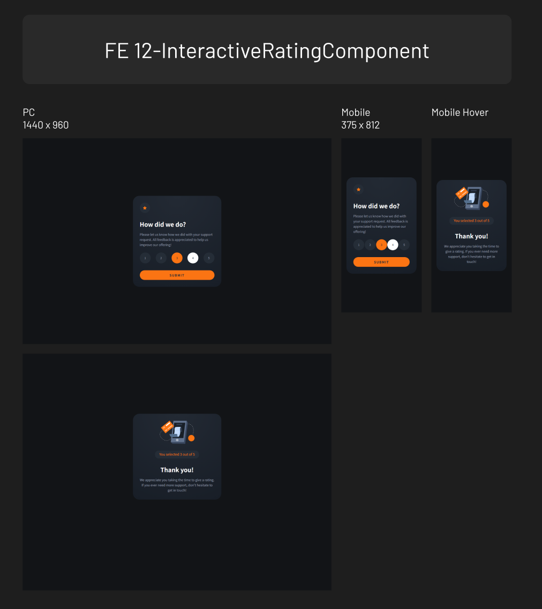

# frontend-mentor

Challenges from Frontend Mentor

## Table of contents

- [01 QRcode](#01-qrcode)
  - [01 Screenshot](#01-screenshot)
  - [01 Links](#01-links)
- [02 BlogPreview](#02-blogpreview)
  - [02 Screenshot](#02-screenshot)
  - [02 Links](#02-links)
- [03 SocialLinksProfile](#03-sociallinksprofile)
  - [03 Screenshot](#03-screenshot)
  - [03 Links](#03-links)
- [04 RecipePage](#04-recipepage)
  - [04 Screenshot](#04-screenshot)
  - [04 Links](#04-links)
- [05 ProductPreviewCard](#05-productpreviewcard)
  - [05 Screenshot](#05-screenshot)
  - [05 Links](#05-links)
- [06 FourCardFeatureSection](#06-fourcardfeaturesection)
  - [06 Screenshot](#06-screenshot)
  - [06 Links](#06-links)
- [07 TestimonialsGridSection](#07-testimonialsgridsection)
  - [07 Screenshot](#07-screenshot)
  - [07 Links](#07-links)
- [08 ArticlePreviewComponent](#08-articlepreviewcomponent)
  - [08 Screenshot](#08-screenshot)
  - [08 Links](#08-links)
- [09 NewsletterSignupWithSuccessMessage](#09-newslettersignupwithsuccessmessage)
  - [09 Screenshot](#09-screenshot)
  - [09 Links](#09-links)
- [10 TimeTrackingDashboard](#10-timetrackingdashboard)
  - [10 Screenshot](#10-screenshot)
  - [10 Links](#10-links)
- [11 TipCalculatorApp](#11-tipcalculatorapp)
  - [11 Screenshot](#11-screenshot)
  - [11 Links](#11-links)
- [12 InteractiveRatingComponent](#12-interactiveratingcomponent)
  - [12 Screenshot](#12-screenshot)
  - [12 Links](#12-links)
- [13 FaqAccordion](#13-faqaccordion)
  - [13 Screenshot](#13-screenshot)
  - [13 Links](#13-links)
- [14 ContactFormMain](#14-contactformmain)
  - [14 Screenshot](#14-screenshot)
  - [14 Links](#14-links)
- [15 NewsHomepage](#15-newshomepage)
  - [15 Screenshot](#15-screenshot)
  - [15 Links](#15-links)

## 01 QRcode

### 01 Screenshot

### 01 Links

- Solution URL: [https://github.com/zeegu/frontend-mentor/tree/main/01-QRcode]
- Live Site URL: [https://zeegu.github.io/frontend-mentor/01-QRcode/]

## 02 BlogPreview

### 02 Screenshot

### 02 Links

- Solution URL: [https://github.com/zeegu/frontend-mentor/tree/main/02-BlogPreview]
- Live Site URL: [https://zeegu.github.io/frontend-mentor/02-BlogPreview/]

## 03 SocialLinksProfile

### 03 Screenshot

### 03 Links

- Solution URL: [https://github.com/zeegu/frontend-mentor/tree/main/03-SocialLinksProfile]
- Live Site URL: [https://zeegu.github.io/frontend-mentor/03-SocialLinksProfile/]

## 04 RecipePage

### 04 Screenshot

### 04 Links

- Solution URL: [https://github.com/zeegu/frontend-mentor/tree/main/04-RecipePage]
- Live Site URL: [https://zeegu.github.io/frontend-mentor/04-RecipePage/]

## 05 ProductPreviewCard

### 05 Screenshot

### 05 Links

- Solution URL: [https://github.com/zeegu/frontend-mentor/tree/main/05-ProductPreviewCard]
- Live Site URL: [https://zeegu.github.io/frontend-mentor/05-ProductPreviewCard]

## 06 FourCardFeatureSection

### 06 Screenshot

### 06 Links

- Solution URL: [https://github.com/zeegu/frontend-mentor/tree/main/06-FourCardFeatureSection]
- Live Site URL: [https://zeegu.github.io/frontend-mentor/06-FourCardFeatureSection]

## 07 TestimonialsGridSection

### 07 Screenshot

### 07 Links

- Solution URL: [https://github.com/zeegu/frontend-mentor/tree/main/07-TestimonialsGridSection]
- Live Site URL: [https://zeegu.github.io/frontend-mentor/07-TestimonialsGridSection]

## 08 ArticlePreviewComponent

### 08 Screenshot

### 08 Links

- Solution URL: [https://github.com/zeegu/frontend-mentor/tree/main/08-ArticlePreviewComponent]
- Live Site URL: [https://zeegu.github.io/frontend-mentor/08-ArticlePreviewComponent]

## 09 NewsletterSignupWithSuccessMessage

### 09 Screenshot

### 09 Links

- Solution URL: [https://github.com/zeegu/frontend-mentor/tree/main/09-NewsletterSignupWithSuccessMessage]
- Live Site URL: [https://zeegu.github.io/frontend-mentor/09-NewsletterSignupWithSuccessMessage]

## 10 TimeTrackingDashboard

### 10 Screenshot

### 10 Links

- Solution URL: [https://github.com/zeegu/frontend-mentor/tree/main/10-TimeTrackingDashboard]
- Live Site URL: [https://zeegu.github.io/frontend-mentor/10-TimeTrackingDashboard]

## 11 TipCalculatorApp

### 11 Screenshot

### 11 Links

- Solution URL: [https://github.com/zeegu/frontend-mentor/tree/main/11-TipCalculatorApp]
- Live Site URL: [https://zeegu.github.io/frontend-mentor/11-TipCalculatorApp]

## 12 InteractiveRatingComponent

### 12 Screenshot

### 12 Links

- Solution URL: [https://github.com/zeegu/frontend-mentor/tree/main/12-InteractiveRatingComponent]
- Live Site URL: [https://zeegu.github.io/frontend-mentor/12-InteractiveRatingComponent]

## 13 FaqAccordion

### 13 Screenshot

### 13 Links

- Solution URL: [https://github.com/zeegu/frontend-mentor/tree/main/13-FaqAccordion]
- Live Site URL: [https://zeegu.github.io/frontend-mentor/13-FaqAccordion]

## 14 ContactFormMain

### 14 Screenshot

### 14 Links

- Solution URL: [https://github.com/zeegu/frontend-mentor/tree/main/14-ContactFormMain]
- Live Site URL: [https://zeegu.github.io/frontend-mentor/14-ContactFormMain]

## 15 NewsHomepage

### 15 Screenshot

### 15 Links

- Solution URL: [https://github.com/zeegu/frontend-mentor/tree/main/15-NewsHomepage]
- Live Site URL: [https://zeegu.github.io/frontend-mentor/15-NewsHomepage]
